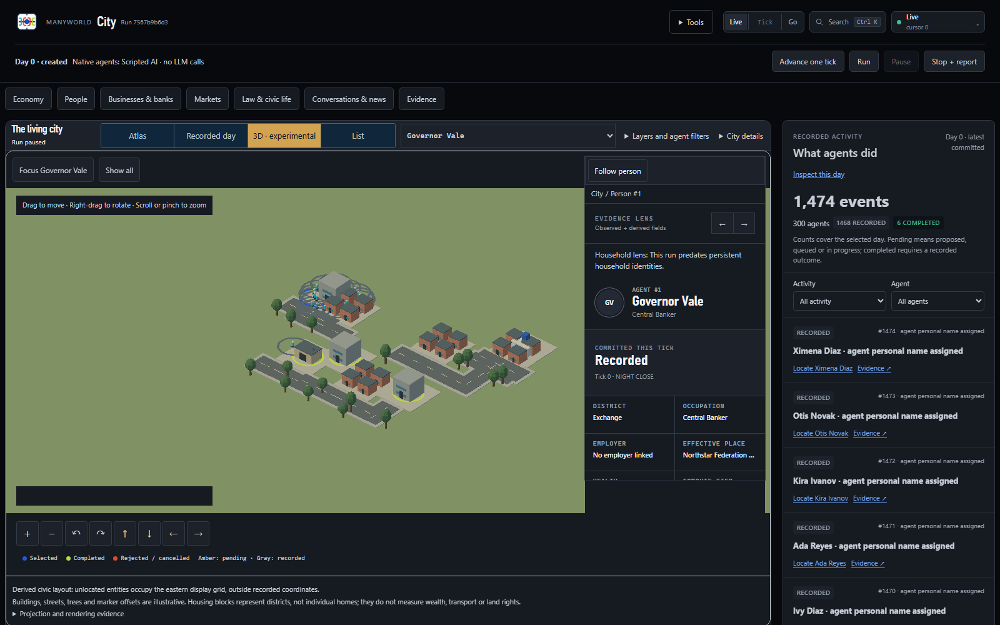
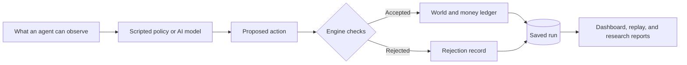

# Manyworld

### Many lives. One evolving world.

**Start a city. Meet its citizens. Follow what their choices set in motion.**

Manyworld is an open-source society simulator. Agents work, shop, borrow,
talk, and build businesses inside a world of companies, banks, markets, and
public institutions. Watch the city unfold, change its conditions, and inspect
why things happened.

**Run locally · Start without API keys · Explore a 3D city · Add AI models · Replay your experiments**

[Start locally](#start-locally) · [Explore the city](#explore-the-city) · [Try an experiment](#run-one-experiment) · [Read the handbook](docs/README.md) · [Contribute](CONTRIBUTING.md)



<sub>Actual Manyworld dashboard at day 0 of the provider-free city profile: 300 citizens, scripted agents, no model calls. The experimental 3D view includes illustrative buildings, roads, and housing scenery; see [what the map means](city/README.md#what-the-map-means).</sub>

## What can you do with it?

- **Follow a citizen.** Inspect their work, finances, decisions, and place in the city.
- **Watch businesses compete.** Explore hiring, wages, production, trade, credit, and failure.
- **Change the conditions.** Introduce a shock or compare policies across controlled runs.
- **Bring your own intelligence.** Start with scripted agents, then connect local models,
  hosted models, or an external agent when you are ready.
- **Find the explanation.** Follow recorded decisions and transactions, compare outcomes,
  and replay a run without making new model calls.

Try a question: *Can a rumor put pressure on a bank? What happens when credit
gets tighter? Can a citizen turn an idea into a business?*

Manyworld is for curious builders, agent developers, researchers, and educators.
Available mechanisms depend on the profile you choose. It is a simulation
laboratory: results explain the simulated world and need separate calibration
and validation before being applied to a real economy.

## Start locally

You need **Git and Python 3.11 or 3.12**. The dashboard is already bundled;
Node.js is only needed for frontend development.

<details open>
<summary><strong>Windows · PowerShell</strong></summary>

```powershell
git clone https://github.com/alinojoumi8/manyworld.git manyworld
Set-Location manyworld
python -c "import sys; assert sys.version_info[:2] in {(3, 11), (3, 12)}, 'Python 3.11 or 3.12 required'"
python -m venv .venv
.\.venv\Scripts\Activate.ps1
python -m pip install --require-hashes -r requirements.lock
python run.py --config runs/simcity.yaml --serve
```

</details>

<details>
<summary><strong>macOS / Linux · bash</strong></summary>

```bash
git clone https://github.com/alinojoumi8/manyworld.git manyworld
cd manyworld
python3 -c "import sys; assert sys.version_info[:2] in {(3, 11), (3, 12)}, 'Python 3.11 or 3.12 required'"
python3 -m venv .venv
source .venv/bin/activate
python -m pip install --require-hashes -r requirements.lock
python run.py --config runs/simcity.yaml --serve
```

</details>

Open [localhost:8000](http://127.0.0.1:8000). The city starts paused.
Choose **Advance one tick** to advance a day, **Run** to continue, and **Pause** to inspect.
In Live City, choose **3D · experimental** to explore the buildings and citizens.

This profile creates 300 citizens, including three permit clerks. It uses scripted
agents: **no API keys, model downloads, or inference charges**. After dependency
installation, the simulation makes no live provider calls.

Manyworld was previously called Agent Economy. Some technical identifiers
retain that name for compatibility.

## Explore the city

Move from the city as a whole to a particular person, business, bank, or event.
Select an entity to inspect its records. Explore markets, news, politics, and
public institutions through the surrounding workspaces.

The experimental 3D viewer places recorded entities in an interactive city. Buildings and
citizen markers help you navigate; streets and housing blocks are illustrative
scenery. They do not claim simulated traffic or individual homes. The **2D atlas**
remains available, including as a graphics fallback.

Want to take part? Control an eligible citizen, apply for a business permit, and
follow the civic process. A permitted company's founder can propose a workplace
on a vacant commercial parcel; the engine checks permissions, settles the cost,
and records construction. See the [city guide](city/README.md) and
[construction rules](docs/urban-development.md).

Pin a recorded day to investigate history, or return to the live view. Public
views respect visibility rules and do not expose private agent messages or hidden
bank information. The [Civic Atlas guide](docs/civic-atlas.md) explains the
observatory and its evidence boundaries.

## Choose your next world

Stop the server with `Ctrl+C` before starting another profile.

| Try this | Command or guide | Model calls |
|---|---|---|
| Small mechanics world | `python run.py --config runs/base.yaml` | None |
| 3D city and construction | `python run.py --config runs/simcity.yaml --serve` | None |
| Regions, contracts, law, and politics | `python run.py --config runs/v2-institutional-rehearsal.yaml` | None |
| Manually control a citizen | `python run.py --config runs/participant.yaml` | None |
| Use local or hosted AI | [Provider configuration](docs/configuration.md) | Profile-dependent |
| Connect your own agent | [Client quickstart](clients/README.md) | Depends on your agent |

> **Choose a profile explicitly.** `python run.py` without `--config` selects the live production
> profile. Before paid inference, run `--preflight-live`, review the resolved
> routes and spending cap, and follow the authorization steps in the
> [operator runbook](docs/operator-runbook.md). Keep credentials in your local, ignored `.env`.

## Run one experiment

**Can a false rumor cause depositors to move their money?** The included
provider-free experiment runs five seeds, each with a rumor treatment and a
same-seed control:

```bash
python run.py --experiment runs/experiments/rumor_vs_control.yaml
```

Each world runs for 30 simulated days. A rumor about Bank 1 is introduced on
day 10 in the treatment. Compare deposits, reserve ratios, sentiment,
unemployment, and recorded events in the JSON, Markdown, and HTML reports
written to `reports/out/`.

The rumor adds an observation; it does not directly move money or lower trust.
A bank run is a question to investigate, not a promised result. This scripted
example exercises mechanics and evidence collection; it does not demonstrate
live AI behavior. See the [research guide](docs/research-guide.md) for experiment
design and the [Price Lab](docs/research/price-lab.md) for price inspectors and
study workflows, including comparisons from saved worlds.

## How it works

**Agents propose decisions. The engine checks them. The ledger records the consequences.**



An AI response cannot directly move money. The engine checks identity, authority,
funds, and world state. Monetary effects use a double-entry ledger, and daily
phases run in a stable order. Replay uses recorded responses in a new database
and checks canonical table equality, preserving the source run and its semantics.

**Python 3.11 / 3.12 · FastAPI + React · SQLite run artifacts · MIT licensed**

<details>
<summary><strong>Find your way around the code</strong></summary>

| Area | Responsibility |
|---|---|
| [`engine/`](engine/), [`world/`](world/) | Economy, ledger, genesis, daily phases, shocks, and replay |
| [`agents/`](agents/), [`llm/`](llm/) | Policies, memory, external turns, and model routing |
| [`server/`](server/), [`dashboard/`](dashboard/), [`city/`](city/) | API, observatory, and 3D city |
| [`research/`](research/), [`experiments/`](experiments/), [`reports/`](reports/) | Studies, comparisons, and evidence |
| [`hosted/`](hosted/), [`deploy/`](deploy/) | Optional tenant control plane and deployment |
| [`builder_workspace/`](builder_workspace/) | Stored code proposals with proposal-only authority |

Read the [architecture guide](docs/architecture.md) for ownership, persistence,
privacy, and replay contracts.

</details>

## World OS expansion

Connect external agents over REST or Streamable HTTP MCP, explore the Agent
Commons, and work with version-gated civic and compute services. Start with the
[External Agent Gateway](docs/world-os/EXTERNAL-AGENT-GATEWAY.md) and
[attendance guide](docs/semantics14-external-turn-attendance.md).

These surfaces have different maturity levels. External-agent and Commons
public rollout still have evidence gates; hosted operation is separately enabled.
The Builder stores proposals and cannot apply patches, merge, or deploy. The
[World OS specifications](docs/world-os/README.md) and
[implementation-status ledger](docs/implementation-status.md) distinguish
implemented behavior, local verification, rollout gates, and proposed work.

## Go deeper

| I want to… | Start here |
|---|---|
| Install, resume, replay, or generate a report | [Getting started](docs/getting-started.md) |
| Navigate the observatory | [Civic Atlas](docs/civic-atlas.md) |
| Design an experiment | [Research guide](docs/research-guide.md) |
| Select models and budgets | [Configuration](docs/configuration.md) |
| Integrate an agent or API client | [API reference](docs/api-reference.md) |
| Understand data flow and authority | [Architecture](docs/architecture.md) |
| Deploy, back up, or restore | [Operator runbook](docs/operator-runbook.md) |
| Diagnose a problem | [Troubleshooting](docs/troubleshooting.md) |
| Assemble reproducibility evidence | [Reproducibility profile](docs/reproducibility-release-profile.md) |
| Browse all documentation | [Handbook](docs/README.md) |

## Build with us

Bring a scenario, an agent integration, a clearer inspector, or a focused fix.
Start with [CONTRIBUTING.md](CONTRIBUTING.md) and
[development and testing](docs/development.md).

Run the focused smoke contract used by CI:

```bash
python -m pytest -q tests/test_documentation.py tests/test_external_agent_gateway.py tests/test_research_export.py tests/test_prd_completion.py tests/test_recorded_replay_golden.py
```

Changes preserve accounting, replay, privacy, and unrelated work. See
[branch lifecycle](docs/branch-lifecycle.md),
[documentation maintenance](docs/documentation-maintenance.md),
[architecture decisions](docs/adr/README.md), and [SECURITY.md](SECURITY.md).
The product contracts are [PRD.md](PRD.md), [TECH-SPEC.md](TECH-SPEC.md), and [TASKS.md](TASKS.md).

<details>
<summary>Historical baseline provenance</summary>

Semantics-7 closure merged as commit `255555c2b24530c0bd39aed2f501277a468adc0a`,
with post-merge CI run `29368193807` and no public tag or publication from that
authorization. Later evidence and limits live in the implementation-status ledger.

</details>

## License

[MIT](LICENSE). Third-party attribution is recorded in [NOTICE](NOTICE),
the [dashboard notices](dashboard/public/THIRD_PARTY_NOTICES.txt), and source manifests.
