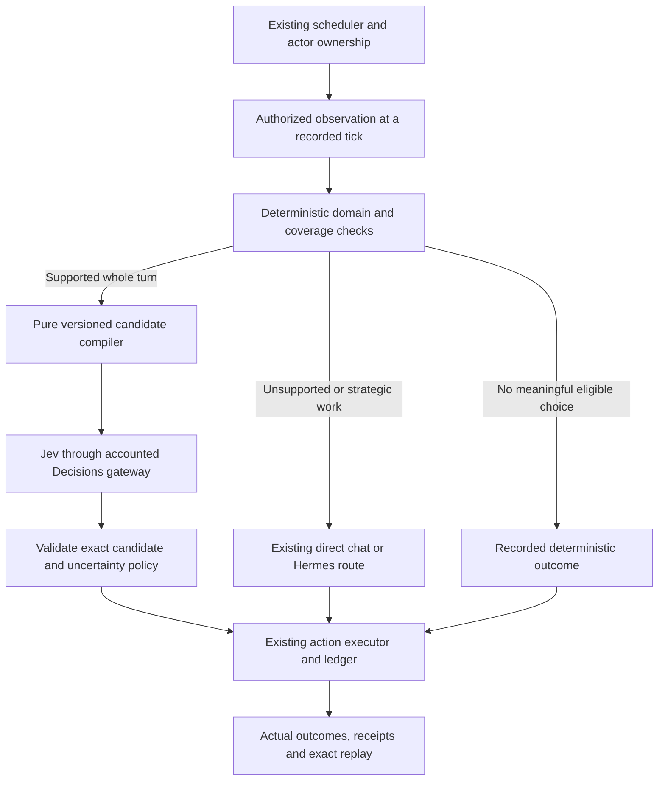

# Jev decision expansion: review and implementation plan

Date: 2026-09-19. Status: **proposal for review; implementation has not started**.
Code reviewed: branch `JEV`, commit `0c92b041ae1e77479e11932e990df96f92dfdc14`.

## Recommendation

Expand Jev incrementally into **routine company operations, career choices and
personal budgeting**. Keep DeepSeek and MiniMax for open-ended planning and
writing, and keep every economic rule, authorization and monetary effect in the
deterministic engine. Jev should select a complete, eligible action from a
bounded menu whose terms the application has already calculated.

The next implementation should be **a native-founder pilot**, starting with
posted goods prices and then hiring. These are substantial existing workloads,
not hypothetical features. Do the contract and measurement work below first.
Keep the existing shopping policy opt-in and validate its prospective v3
pending-application improvement in a separate new-world test.

There is no reason to replace all agent thinking with Jev. The product needs
distinct people with goals, relationships, memories and the ability to form new
plans. Frequent execution choices fit Jev; generating those plans and expressing
them usually require the existing chat models.

This review changed no runtime code, provider routing, credentials, world,
Hermes profile or automation. It started no paid inference. The completed world
`e911d9c2a8` stays at tick 100 with its recorded v2 policy. Its paused heartbeat
stays paused. Draft PR 95 is not merged or changed by this planning work.

## 1. What the completed experiment actually establishes

The [100-tick report](2026-09-19-jev-100-tick-live-test.md) verifies 422 Jev
selections, USD 0.043834056 in Jev charges, median latency 457 ms and p95 613 ms.
There were no native provider failures or JSON repairs in that run. All ten
Hermes citizens submitted on every post-admission day, and the recorded replay
was exact with provider HTTP disabled and source files unchanged.
The earlier report also records seven recovered Hermes timeouts and other
explicit recoveries. Faster native selections do not remove those external
process delays; measure end-to-end time separately.

Jev handled five native citizens' bounded shopping/employment turns. It did not
control the ten external Hermes agents. Of 500 typed-policy receipts, 78 routed
outside the menu. The world used semantics 16, so it did not validate the later
household/time/estate/population features merely because those exist in today's
repository. V3 has provider-free coverage, but this run was not a live v3 test.

For this review I queried the closed final snapshot in read-only mode and
aggregated its recorded calls by purpose:

| Native workload | Calls | Recorded USD | Interpretation for expansion |
|---|---:|---:|---|
| Jev routine citizen choices | 422 | 0.043834056 | Existing integration baseline |
| DeepSeek founder decisions | 414 | 0.327580730 | First expansion target; 35.2% of native spend |
| Other citizen/staff `decision` calls, DeepSeek + MiniMax | 264 | 0.230022120 | Mixed duties; not 264 automatically transferable turns |
| MiniMax reporter and editor | 200 | 0.188907060 | Selection may move; article writing remains generative |
| DeepSeek conversations | 200 | 0.039830030 | Retain dialogue generation |
| DeepSeek memory compression | 111 | 0.045411770 | Retain summary generation; optional relevance scoring later |
| Credit officer, VC, central banker and lawyer | 57 | 0.053745050 | Small workload with greater policy complexity |
| Persona creation | 10 | 0.001560600 | Retain existing generative route |
| **Total** | **1,678** | **0.930891416** | Excludes Hermes and separate readiness usage |

Direct-provider costs use the configured tariffs; they are not reconciled
provider invoices. Different purposes have different prompts and outputs, so
these costs and latencies are not a controlled model-quality comparison.

The 414 founder responses proposed 77 job offers, 24 job postings and 29 price
changes. Some turns proposed multiple actions. **298 responses contained only
`do_nothing` or an empty action list**, with no belief updates. This is an
opportunity to study cheaper routine choices, not evidence that those 298 turns
were unnecessary: choosing to wait may require considering real alternatives.
These are proposal counts, not accepted hires, transactions or business gains.

The prior Jev test also exposed two limits worth preserving in the plan:

- Of 38 application attempts, 27 were accepted idempotent repeats. V3 filters
  existing pending applications, but a live test still needs to verify useful
  applications and actual hires rather than reporting acceptance alone.
- A job and a goods purchase became unavailable before execution because earlier
  agents consumed the opportunities. The engine correctly rejected them. Model
  selection cannot guarantee a shared resource will still exist at execution.

## 2. How the current project routes decisions

The native path is scheduler -> actor-visible context -> optional typed menu ->
gateway -> deterministic action executor -> ledger, memories and receipts.
External and participant decisions enter through their own authenticated paths
and are excluded from native model dispatch before execution is ordered.

Important source anchors from the reviewed working tree:

| Surface | Current behavior | Implementation anchor |
|---|---|---|
| Native/external ownership | Removes externally controlled actors from native dispatch; executes in stable agent order | `agents/runtime.py:339` |
| Purpose selection and observation | Owners become `founder`; institutions retain specialized purposes; newer semantics attach additional contexts | `agents/prompts.py:274`, `:574` |
| Typed admission | Requires purpose `decision`; v2/v3 exclude actors with roles; uses compute-tier and population gates | `agents/typed_policy.py:27` |
| Existing menu | Shopping and apply/accept-job bundles, wait and escalation; pure compiler | `agents/decision_candidates.py:91` |
| Capability exclusions | Company management, legal/civic work, portfolio/study days, household duties and other special cases | `agents/decision_candidates.py:53` |
| Transport restriction | Currently accepts only typed `decision`, `preflight`, `decision_evaluation` purposes | `llm/openrouter_decisions.py:50` |
| Accounted evaluation | Validates answers, binds resolved model and reserves shared allowance before dispatch | `llm/gateway.py:1292` |
| Final authority | Executes actions and records their real results; study and civic attendance consume the whole turn | `engine/actions.py:201`, `agents/runtime.py:1379` |
| Founder inputs | Own firm cash, inventory, posted price, payroll, applicants and negotiation state | `agents/prompts.py:1577`, `:1712`, `:1798` |
| Existing founder baseline | Pricing, recruitment, loans, venture funding, IPO and regional shipment proposals | `agents/policies.py:834` |
| Career and compute | Existing study options, eligible plan offers, cancellation and sponsorship terms | `engine/cognition.py:800` |
| Daily plans and households | Bounded time plans; separate proposals and assent from affected adults | `engine/daily_time.py:307`, `engine/families.py:384` |
| Construction, regions, frontier | Existing opportunities with action terms, costs, duration or prerequisites | `engine/construction.py:1021`, `engine/regions.py:237`, `engine/frontier.py:283` |
| Public decision evidence | Sanitized summaries, newest 200 receipts; private observations/menus excluded | `server/projections/decisions.py:5`, `:24` |
| Matched studies | Frozen menus, arm/background checks, allowance and comparative summaries | `research/decision_studies.py:40`, `:56`, `:148`, `:236` |

I used the codebase graph to inspect these paths and the 105 indexed action
handlers, then read the relevant implementations. The coverage check reported
no recorded parse gaps for the cited Python files, but flagged file-metadata
freshness. Eleven critical excerpts were checked against the working tree and
matched. This was a decision-path audit, not a line-by-line security audit of
every repository file or a new validation of every engine subsystem.

## 3. What Jev can provide through the existing OpenRouter integration

OpenRouter exposes a Decisions endpoint at
`POST https://openrouter.ai/api/alpha/decisions` with bearer-key authentication
and `state`, `questions` and `model` fields. It supports choice, score and noul
questions. Reuse the existing adapter and `OPENROUTER_API_KEY`; no new SDK,
TypeSafe account or frontend credential is needed.
[OpenRouter API reference](https://openrouter.ai/docs/api/api-reference/alphadecisions/submit-a-decisions-questions-and-answers-request).

- **Choice:** choose an existing action/bundle ID. Use this for economic actions.
- **Score:** rate a semantic quality on an explicit ordered rubric, such as a
  story's relevance to an outlet. Code interprets the result; it is not a dollar
  amount, market price, legal finding or predicted economic return.
- **Noul:** estimate whether a clearly defined proposition is true, such as
  whether a visible message contains a supplier warning. It returns a probability
  and has no separate confidence field.

TypeSafe describes text-only evaluation and independent questions sharing a
state. Jev does not generate dialogue, articles, code or reasoning explanations.
Batch independent questions for the **same authorized observation** when useful;
do not expect one answer to depend on another answer in that request.
[System One](https://docs.typesafe.ai/concepts/system-one),
[Choice](https://docs.typesafe.ai/primitives/choice),
[Score](https://docs.typesafe.ai/primitives/score),
[Noul](https://docs.typesafe.ai/primitives/noul).

Keep `typesafe/jev-1.13` pinned with an explicit resolved-revision allowlist. The
completed run resolved to `typesafe/jev-1.13-20260917`. Do not switch scientific
runs to the moving `jev-latest` alias. The currently listed price is USD 0.042
per million input tokens, zero output-token charge, with a 32K context window.
Recheck this and the alpha contract before an approved live experiment.
[Jev model page](https://openrouter.ai/typesafe/jev-1.13),
[latest alias](https://openrouter.ai/~typesafe/jev-latest).

**Provider boundary remains explicit:** Jev alone uses OpenRouter; DeepSeek and
MiniMax use their direct APIs; Hermes retains its existing authenticated route.
An unavailable Jev service pauses visibly. An explicitly declared, logged
escalation to a direct provider is different from a silent outage fallback.

## 4. Priority matrix

Priority reflects useful new behavior, existing workload, ease of expressing
complete alternatives and the cost of getting the simulation policy wrong.

| Priority | Domain | Hand to Jev | Retain elsewhere | Recommendation |
|---|---|---|---|---|
| P0 | Current routine policy | Existing shopping/job choices, prospective v3 | Eligibility, pending history, inventory checks | Stabilize and measure before expanding |
| P1 | Founder goods pricing | Keep/reduce/raise a posted price from bounded proposals | Cost calculations, payroll viability, effects | First new domain |
| P1 | Employer hiring | Choose applicant/offer/posting/hold from eligible alternatives | Vacancy capacity, counterparty checks, wage math | Next, combined carefully with pricing |
| P1 | Citizen career | Apply, accept, counter, reject or study from exact alternatives | Qualifications, career cadence, XP and turn exclusivity | Strong next extension |
| P2 | Personal finances | Insurance purchase/retention, retirement drawdown, compute renewal | Ledger transfers, premiums, eligibility, real API budget | Small domain-specific menus |
| P2 | Daily time and care | Choose among complete tomorrow schedules | Time accounting, wages, care delivery, effects on children | Useful on semantics 18+ fixtures |
| P2 | Regional trade and construction | Select among competing eligible commitments | Funding, ownership, permits, work, logistics, completion | Only where a meaningful choice exists |
| P2 | News desk | Select source-backed story or framing category | Article writing and factual grounding | Optional experiment; savings not established |
| P3 | Attention and memory | Score relevance of already-visible items | Access controls, truth, retrieval baseline, summary writing | Only if it improves measured decisions |
| P3 | Hermes helper | Recommend a catalog-bound option on request | Persona, session, goals and final submission ownership | Opt-in assistance after native domains work |
| Research only | Portfolio, FX, credit, VC | Later shadow choices among bounded terms | Clearing, solvency, balances, issuance and accounting | Separate economic-policy studies |
| Defer | Courts, legislation, central-bank policy, mergers, estate disposition | At most future advisory classification | Institutional decisions and authoritative findings | No default migration in this plan |
| Keep current | Conversation, persona, business ideas, narrative reports, Oracle explanation | Optional bounded routing only | Generative models; Oracle stays read-only | Jev does not replace these outputs |

### Founder pricing and hiring: the first useful release

Pricing input should include the firm's own inventory, cash, recent **executed
units**, sales revenue, actual input cost, payroll obligations, product and
declared strategy. Generate a small price ladder around its current posted
price, plus hold and escalation. Examples such as -5%, unchanged and +5% are
proposed experimental policy parameters, not model-discovered laws or facts.
Choose bounds from the configured business policy and version them.

The current `_firm_view.recent_sales` counts sale events, not units. It must not
be relabeled as units or compared with inventory units without defining a new
observation field/window. Recovery-specific context already contains a
`recent_sales_units` field. Reuse the appropriate deterministic calculation;
keep historic observations unchanged.

For hiring, expose live applications, pending counters, vacancies and affordable
wage alternatives. Preserve application/offer ownership, expiry and bilateral
acceptance. Filter already-negotiating applications and duplicate postings
before ranking. Count new offers, accepted hires and sustained employment—not
just accepted repeated actions. Firing, new borrowing, VC pitches and IPOs stay
with the existing route in the first release.

Both personal and firm funds may appear in a founder's context. They remain
separate accounts with separate obligations and reserve constraints. A pricing
choice cannot spend the owner's personal cash, and a personal study decision
cannot be bundled with a whole-turn company action.

Many quiet founder turns still have meaningful alternatives. Use a no-call
path only when the declared policy proves there is no meaningful eligible
choice. Do not infer that from the previous model choosing to wait. Preserve
strategic review opportunities and escalation for new products, finance,
messages and other unrepresented needs.

### Career, compute and personal budgeting

Extend the existing labor menu to support an incoming offer's accept/counter/
reject alternatives. Candidate wages are calculated in code from visible terms
and declared preferences; Jev never invents an application ID or counterparty.
Study choices come from existing skill options and compete with the whole turn.
Do not produce `study_skill` plus shopping or job application: the executor
already rejects the competing action.

Compute plans are a genuine agent-economy choice: cost, renewal state, skill and
expected task needs matter. Jev can choose from the visible eligible plans,
but must not grant itself premium access or increase real-money API allowances.
The current pilot explicitly permits typed evaluation for `local` as well as
other tiers. A future production profile must document whether Jev is a
subsidized basic service or a paid-plan capability, with the same policy in all
comparison arms. Do not change that economic assumption during a model test.

For retirement, generate bounded own-account savings drawdowns and compatible
spending sequences. For insurance, use the actual offer, coverage state and
premium. Treat cancellation and lapse as separate consequential choices with
explicit terms. Do not silently replace the existing bank-trust response.

### Daily life, construction and regional activity

Time planning is a good expression of preferences: work, care and study compete
for a fixed day. Jev may choose an eligible schedule; code still calculates
time delivered, wages and unmet care. The plan applies on its recorded future
tick, not retroactively. Different family and career preferences should produce
different choices, without changing other adults' consent.

Household formation/separation and migration are later domains. Each affected
adult retains an independent decision, required assent and identity. A model
must not manufacture a partner's agreement or optimize everyone through a
single shared private observation.

Construction's current context often supplies **one exact next action**. Paying
Jev to approve an already determined step adds little. Keep deterministic
workflow progression where appropriate; use Jev when multiple affordable
projects, jobs or commitments compete. Frontier tasks already have costs and
durations and can occupy turns. These require an explicit busy/exclusive-work
gate before routine shopping can replace the turn.

Use existing contract-backed regional shipments before exploring free-form
logistics. Migration needs the actual destination, currency, job and household
effects; a higher nominal wage is not enough. Do not claim this produces richer
3D construction unless the test profile actually enables the relevant world
features and records the resulting events.

### Media, memory and Hermes

The newsroom currently asks a reporter for 2–4 drafts, then asks an editor to
select **and write** a framed article. Replacing just selection while still
making both writing calls adds cost. Test a redesigned pipeline—bounded topic
selection followed by one generative article call—against the current pipeline
for grounded facts, outlet character and coverage. It is a distinct policy
change, not a transparent drop-in model swap.

Memory retrieval is already a deterministic ranking of up to 200 memories;
daily compression writes first-person summaries. Keep that baseline. Jev
relevance/importance scoring is worthwhile only if better retrieval offsets the
extra inference and does not starve rare but important events. If belief
interpretation is studied later, record it as an actor's belief, not objective
world truth, and keep bounded values and authorized source links.

Hermes currently bypasses native typed admission. A future helper should take
that citizen's own authorized observation and bounded catalog, then return a
recommendation plus an auditable receipt. Hermes keeps the final submission
unless an explicit profile setting delegates that domain. Revalidate through
the existing projection hash, target tick, idempotency key and one-action-per-
wake contract. Keep all ten personas and sessions separate; test on fresh
clones. Never resubmit a queued turn or create a second clock controller.

## 5. Prerequisites the review uncovered

1. **Expansion is not a configuration-only switch.** Typed policy admission and
   the transport purpose allowlist both exclude founder calls. Add explicit
   registered domains while preserving the original purpose for accounting.
   Do not remove the guard or make Jev a general chat completion provider.

2. **The menu defines the available behavior.** Current projection emphasizes
   cash, risk, dependents and six short memories. New domains need the actor's
   relevant skills, commitments, goals, authorized messages and business facts.
   Candidate generation and truncation can dominate the model's behavior; log
   excluded alternatives and distinguish policy assumptions from observed needs.

3. **Turn coverage must be explicit.** Current exclusions are appropriate to the
   narrow pilot but do not themselves cover every newer capability, including
   frontier commitments and optional compute/insurance choices. Add fixtures
   for each enabled subsystem. Recognize due, exclusive and material unresolved
   work without treating every optional feature as a reason to bypass Jev on
   every turn. Unsupported whole turns retain the existing declared route.

4. **Confidence reporting needs correction before expansion claims.** The UI
   correctly calls confidence answer concentration. However,
   `research/decision_studies.py:236` currently reports ECE/Brier-style values
   from that concentration versus label agreement. Label these as descriptive
   diagnostics or replace them with a properly defined probability-based
   analysis in a new report contract. Confidence is not a predicted probability
   of a profitable or correct action. TypeSafe documents this distinction in
   [Confidence](https://docs.typesafe.ai/confidence).

5. **Broader primitives need provider-contract tests.** The local validator
   permits up to 255 Score rubric entries, while the current TypeSafe Score docs
   specify 2–10. Use the documented conservative bound for new live questions
   and confirm the OpenRouter behavior in an approved small probe. This is a
   compatibility discrepancy, not evidence that the current Choice pilot failed.
   Keep historical validation/replay behavior available when versioning the fix.

6. **Frozen studies currently understand one `action` question.** Transport
   supports multiple questions, but `TypedDecisionPolicy.complete` and
   `research.decision_studies.frozen_menu` assume one action choice. Add explicit
   domain/answer interpretation before score or noul can influence a policy.

7. **Scientific comparisons must hold cognition constant.** Typed selections
   emit no prose reasoning or belief updates; the former chat envelope may.
   Preserve memory/strategic cadence where possible and disclose the difference
   wherever it remains. A speed gain is not automatically a like-for-like brain
   replacement. Identical model preferences across the whole city could also
   reduce behavioral diversity and increase coordinated shortages.

## 6. Proposed architecture



### Versioned domains, with a small first implementation

Introduce a prospective composite policy version, provisionally
`bounded-economic-choice-v4`, with a registry of named compilers. Preserve
v1/v2/v3 byte-compatible code paths. Start with `citizen_routine` and
`founder_operations`; do not create a generic autonomous planner framework.

A compiler receives a detached authorized context, explicit preferences,
versioned parameters and a resource summary. It returns:

- Domain and compiler version; observation and menu hashes.
- Exact candidate IDs, complete action bundles and factual consequences/costs.
- A deterministic same-menu comparator; wait and declared escalation.
- Coverage and exclusion reasons, resource/turn requirements and question schema.

The dispatch decision remains deterministic. Do not pay another model to infer
an agent's role or whether it has a firm. Preserve the scheduler's cadence,
governor limits and principal ownership.

### Resource compatibility

Maintain a prospective per-turn resource view: personal cash by currency, firm
cash by currency, reserved/committed obligations, time, employment state and
exclusive actions. Calculate compatible bundles before asking Jev. Aim for a
small menu, initially at most 64 alternatives as a proposed product limit,
within the endpoint's 255-option bound. If useful alternatives cannot be
represented, escalate rather than silently discarding them to fit the limit.

Use one Choice for decisions sharing funds or time. Independent questions can
be batched for annotations, not independently combined into an overspending
action bundle. Separate principals never share a private batch state.

Compatibility at observation time is not a promise of execution. Preserve
current stable execution and per-action validation. Existing bundles can partly
succeed; do not introduce atomic all-or-nothing execution by accident. Distinguish
compiler mistakes, invalid selections, legitimate shared-resource races and
idempotent repeats in outcomes. Do not retry a paid decision merely because
another actor bought the stock first.

### Evidence, budgets and privacy

Every receipt should add domain/version, controller (`native`, `hermes_helper`
or deterministic), routing reason, candidate count, excluded count, question
hashes, selected action, uncertainty policy, actual effects and call costs.
Keep model-provided probabilities distinct from application-generated labels.
Never fabricate a first-person explanation of why Jev chose an option.

Persist every physical attempt and settlement in the existing allowance system.
Charge preflight, retries, escalation and invalid billable responses. Preserve
restart reservations and exact resolved-model binding. Keep schemas strict and
pause on invalid or unavailable providers. Enforce the Jev-only OpenRouter
restriction for new live profiles in configuration validation as well as tests
of effective routing. Keep historical recorded data readable for exact replay.

Public decision views should show domain, route, outcome and aggregate cost,
including all-run totals with a clearly labeled recent window. Raw observations,
private inboxes, financial details and full menus remain access-controlled.
Memory, job, product and message text remains untrusted input. It cannot authorize
an action or override the schema, and actor-specific privacy tests must cover it.

### Compatibility and rollout

Use new policy/compiler/observation/report versions for changed contracts.
Additive database fields or tables only if needed; most evidence can initially
live in versioned receipts. If engine mutation or historical outcome semantics
must change, use a new `engine_semantics_version` and a separate migration plan.

Enable domains explicitly in new profiles; default them off. Do not patch the
completed v2 world's config, rewrite old receipts or replay an old run through a
new compiler. Roll back by pausing the new run and disabling the new domain in a
subsequent authorized configuration/fork. Never reinterpret already-recorded
decisions or replace queued submissions during a rollback.

## 7. Implementation sequence and acceptance gates

All packages below are proposed work, not features implemented by this review.

| Package | Scope and principal files | Done when |
|---|---|---|
| 0. Contracts and baseline | `llm/decisions.py`, `llm/decision_config.py`, `agents/typed_policy.py`, `research/decision_studies.py`; future versioned domain registry | Old contracts replay unchanged; new primitive limits, coverage, probabilities and purpose routes have provider-free tests |
| 1. Founder pricing | New pure founder compiler; `agents/prompts.py`, `agents/policies.py`, runtime admission and adapter registration | Price menus have correct units/windows, owned firm binding, hold/escalation and same-menu baseline; no authority or prose bypass |
| 2. Hiring and bargaining | Extend founder compiler and citizen labor candidates; reuse labor validation | No pending-offer duplicates or impossible self/counterparty actions; combined price/hiring bundles respect payroll; successful hires and rejected races recorded |
| 3. Career and personal budgets | New career/budget compilers; cognition observation and resource compatibility | Study is exclusive; renewal, insurance and savings terms reconcile; tiers and strategic routes remain explicit |
| 4. Daily life and city commitments | Time, care, migration, construction/trade adapters behind flags | Relevant semantics/features enabled; consent, duration, busy-state, currency, ownership and ledger tests pass |
| 5. Optional perception/media/Hermes | Separate experiments in newsroom, memory and external-agent helper | Demonstrable behavior/latency benefit; no extra writing call hidden as a saving; no double control of Hermes turns |

Ship and evaluate packages separately. Packages 4–5 should not delay a useful
founder pilot. Credit, portfolio, central banking, law and estate decisions are
separate proposals after the earlier evidence is available.

For each package, tests must include:

- Pure deterministic menu generation and stable hashes; observation ownership,
  currency and time boundaries; maximum menu size and excluded alternatives.
- Success and rejection cases; empty menus; malformed answers; unknown IDs;
  missing metadata; contradictory multi-question outputs; no invented money.
- Cross-feature cases: study versus appointment, founder versus care, existing
  application versus new offer, busy frontier actor versus shopping.
- Concurrent contention, stale observations and duplicate/restarted requests;
  no additional action from retrying an already accepted submission.
- Ledger/stock/capacity reconciliation, conservation checks and exact recorded
  replay with HTTP disabled and unchanged source hashes.
- Complete cost settlement and shared caps across every route and retry; provider
  failure pauses; no non-Jev OpenRouter request; no leaked credentials or data.
- UI evidence distinguishes model selection, engine validation, rejection and
  application policy. UI explanations never imply a verified chain of thought.

## 8. Evaluation before enabling a domain by default

### A. Provider-free correctness and a frozen comparison

First establish the fixture/replay gates above. Then prepare four matched arms:
deterministic same-menu baseline, Jev, direct DeepSeek and direct MiniMax. Hold
observation, menus, preferences, scheduling and unrelated background behavior
constant. Measure the router overhead as well as the provider call.

The current freezer exports committed **typed** receipts and excludes outside-
menu turns. It cannot already supply founder or career examples simply by
changing a flag. Add an explicit read-only dataset builder from recorded
authorized request contexts, or use isolated provider-free scenario fixtures.
Record that new menus are counterfactual proposals, not the menus used in the
historical run. Never join a past observation with end-of-run private state or
future events. Exclude incomplete contexts rather than filling unknown facts.

Start with roughly 200 stratified observations for one new domain. Include busy,
scarce-cash, pending-offer, no-choice and conflicting-duty cases, not only easy
shopping examples. Keep calibration and held-out groups separate by actor and
source world; reserve independent worlds for generalization. Equivalent options
may require an acceptable-label set rather than an invented single best answer.
Deterministic comparator agreement is not ground truth.

Record validity, uncertainty/coverage, deterministic violations, applicable
label agreement, same-menu cost and latency. Use probability distributions for
proper probabilistic scoring only where the labels and target are well-defined.
Use concentration to study a coverage-versus-error tradeoff; tune thresholds
per domain on calibration data and freeze them before held-out evaluation.

### B. Prospective worlds and outcomes

After the frozen comparison passes, run a small 20-tick native pilot, then a
100-tick comparison with replicated seeds if the quoted allowance permits.
Promote pricing before adding hiring, then career. Keep the same world features,
seeds, initial populations and background models across arms. Independent worlds
are the primary experimental units because agents compete and affect each other.
Within-city cohorts can test integration, but do not establish causal superiority.

Measure:

- **Founder:** units sold, prices relative to costs, cash flow/runway, payroll
  fulfillment, vacancies filled, firm survival and unfilled demand.
- **Citizen:** achieved consumption, cash reserves, distinct applications,
  accepted offers, sustained employment, skills and obligations met.
- **Behavior:** waiting with valid alternatives, escalation, strategic review,
  diversity across preferences and concentration on the same firm/job.
- **Operations:** end-to-end tick duration, queue time, p50/p95 model latency,
  failures, retries, rejected races, cost per meaningful result and total spend.
- **Scientific integrity:** balance, exact replay, immutable source, zero hidden
  dispatches, stable versions and complete settlement.

All correctness gates are mandatory: zero unauthorized effects, zero ledger
imbalance, exact replay, no silent fallback and no lost/duplicate queued actions.
Economic targets must be declared before launch. A useful initial proposal is
at least 25% lower matched decision cost and 30% lower median decision latency,
with no material worsening in payroll, consumption or employment. Define the
allowed outcome margins and statistical uncertainty per scenario in the study
manifest; these percentages are proposed goals, not results or justified
universal thresholds. If a small study cannot resolve the tradeoff, keep opt-in.

Do not require zero rejected shared-resource races: that would encourage
unrealistic reservation or suppress competition. Require zero avoidable
compiler-invalid choices in fixtures and report actual race rates separately.

### C. Hermes integration test

Only after native correctness, test a helper with **fresh clones of all ten
personas** and their separate sessions. Preserve original profiles and saved
worlds. Begin with recommendations; compare their use and cost with Hermes-only
turns before enabling domain delegation. Reuse a sole supervisor and existing
receipt reconciliation. A 100-tick mixed soak must verify every post-admission
turn, actual outcomes, provider routes, budgets, source hashes and offline replay.

## 9. Costs and authorization for future experiments

At the currently advertised Jev tariff, a hypothetical 3,000-input-token request
costs USD 0.000126 before any separately applicable charges. That is about
USD 0.126 for 1,000 calls, USD 1.26 for 10,000 and USD 12.60 for 100,000.
Question count, menus and retained context affect input size; free output tokens
do not make extra evaluations free.

For illustration only, 414 such founder requests would cost about USD 0.0522,
compared with USD 0.3276 recorded for the old DeepSeek founder workload. This
assumes every turn can transfer and that the new prompts fit that token budget;
neither has been demonstrated. Include chat escalations and retained strategic
work before claiming net savings. The immediate 100-tick saving is measured in
cents; decision quality and scalable behavior matter more than that bill.

Proposed first paid package, **requiring a separate launch decision**: a shared
ceiling of USD 2 and 1,000 physical calls for a small primitive preflight and
approximately 200 observations across the three model arms. The deterministic
arm costs no provider calls. Preflight, repeats, failed billable requests and
escalations consume the same ceiling. Requote tokens/tariffs first; pause before
exhaustion even if the planned sample remains incomplete.

A prospective 100-tick replicated study and Hermes soak need their own concrete
manifest and bounded quote after that evidence. No new spending is authorized
by this document. The completed run's USD 10 cap is not a renewable allowance
for new tests, and this plan does not change or exceed it.

## 10. Review evidence and immediate next step

Current provider-free baseline:

```powershell
.\.venv\Scripts\python.exe -m pytest -q --tb=short --basetemp=<fresh-workspace-temp> tests/test_jev_contract.py tests/test_jev_candidates.py tests/test_jev_runtime.py tests/test_jev_studies.py
```

Result: **63 passed in 41.55 seconds**. The first attempt without `--basetemp`
had 44 passes and 19 setup errors because Windows denied access to the existing
system pytest temporary directory. A new uniquely named directory under this
workspace resolved that environment issue without modifying system permissions
or deleting another test run. These tests validate the existing integration,
not the unimplemented extensions proposed here.

Documentation validation also passed: `python -m pytest -q --tb=short
--basetemp=<another-fresh-workspace-temp> tests/test_documentation.py` returned
**22 passed in 0.46 seconds**. Source references and whitespace were checked;
the frozen source database still matched its recorded SHA-256 after analysis.

The read-only source for the added workload analysis was
`reports/out/jev-hermes-100-20260919/final-source/e911d9c2a8.db`, whose completed
snapshot hash is recorded in the prior report. Only aggregate call counts,
costs and action types were used; private prompts and responses are not copied
into this plan.

**Recommended next coding scope:** package 0 plus founder pricing behind an
opt-in flag, with provider-free fixtures and exact replay first. Then review the
concrete frozen-study manifest before paid execution. Hiring and career follow
once the first domain demonstrates useful behavior without compromising the
simulation's accounting, diversity or reproducibility.
