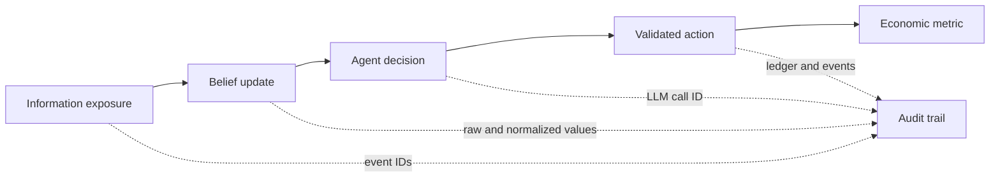

# Research guide and use cases

## What this app is for

Manyworld is an instrument for studying how information, beliefs, and
institutional decisions interact inside a mechanically consistent miniature
economy. It is useful for:

- misinformation and bank-run experiments;
- monetary-policy transmission through banks, firms, and households;
- comparing agent/provider behaviors under the same deterministic mechanics;
- causal demonstrations for economics, AI-agent, and systems courses;
- testing forecast calibration and evidence-bounded Oracle designs;
- studying cost, replay, and auditability in large multi-agent workflows.

It is not a forecast of the real economy, financial advice, or a calibrated
policy model. Scripted runs prove mechanics; live-provider runs add behavioral
evidence but still do not establish external validity.

The [2026-09-06 research city roadmap](plans/2026-09-06-research-city-roadmap.md)
proposes the next research and UI work, including equal coverage of goods and
financial-asset price discovery, households, education, and an interactive city.
Its [source review](plans/2026-09-06-research-city-review.md) records the reviewed
limitations, including the counterfactual runner's artifact/eligibility risks
and the mismatch between this guide's CPI description and the implementation.
The [execution log](plans/2026-09-06-research-city-execution.md) distinguishes
implemented fixes from pending contracts in the specifications.

## Causal chain model

The main research chain is:



Rumor shocks only add observations. They never lower trust or move deposits
directly. The acceptance evaluator uses each exposed depositor's actual
pre-rumor trust and minimum ten-tick value, requires at least a 20% relative
decline from that individual baseline, then checks conversations and outflows.
Runs without belief history fail closed.

## Reproducible experiment workflow

1. State the hypothesis, treatment, outcome, window, and exclusion rules before
   running.
2. Choose a maintained profile and record commit, resolved config, seed(s), and
   semantics version.
3. Run a free scripted rehearsal to validate mechanics and evidence capture.
4. Use treatment/control arms with identical seeds when estimating an effect.
5. Check reconciliation and failure events for every arm.
6. Report distributions, effect size, uncertainty, and negative findings—not
   only a mean or a visually interesting trajectory.
7. Preserve databases and generated evidence with the exact code/config.

Reviewed phenomena YAML must carry the exact top-level `run_id`; acceptance
rejects missing or cross-run evidence even if the named metric moved in the same
direction by coincidence.

Example:

```powershell
python run.py --experiment runs/experiments/rumor_vs_control.yaml
```

Both `--experiment` and `--counterfactual` now create a fresh batch for each
invocation. Source databases, replay databases, and receipts live below the
chosen data root; reports live below `<output>/studies/<study>/<batch>/`.
The printed/returned report path is authoritative. Old flat filenames are
preserved and are no longer overwritten. Full protocol/code digests live in
`manifest.json`; folder names use compact identifiers for Windows compatibility.

Each cell retains its claim, execution status, source receipt, actual recorded
replay comparison, and final eligibility result. Completed means the declared
horizon ended at a committed boundary. A temporary world pause does not prove
completion. Truncated, unreconciled, externally influenced, or unverifiable
attempts remain visible but are excluded from effects. Interrupted batches
retain their manifests and any finished cell results; another launch creates a
new attempt, not an automatic resume of a possibly incompatible artifact.

Effects pair eligible worlds by seed after checking common initial state.
Missing outcomes are `null`; one pair is descriptive and has no confidence
interval. The default minimum of two pairs is a computational floor, not a
scientific sample-size recommendation. Intervals resample whole world pairs.
Zero paired variance leaves standardized effect undefined. All analyses from
these legacy scenario runners remain exploratory, and shared historical RNG
streams do not guarantee identical later exogenous draws after treatments.

## Reading macro metrics

The [versioned registry](../research/metric_registry.py) describes headline
series and provides `read_metric_observation(store, name, tick)` for strict
research reads. Unsupported definitions, missing ticks and unconverted mixed
currencies return an explicit unavailable result. Share-price reads require
an actual trade and include its tick/age. This reader changes no stored series.
See the [model description](research/model-description.md) for mechanism,
time-scale and validation assumptions.

The [Price Discovery Lab backend](research/price-lab.md) adds equal goods/equity
study presets, execution-weighted prices, strict prospective manifests and
bounded provider-free paired execution. Its city/operator UI and induced-value
benchmark campaigns remain under implementation.

- `gdp_proxy`: final-goods sales during one tick; it excludes wages.
- `gdp_proxy_30d`: rolling 30-tick sum of final-goods sales.
- `labor_income`: gross wages paid during one tick. Because payroll is periodic,
  the dashboard presents this flow as a rolling 30-day total so income remains
  visible between paydays.
- `cpi`: legacy posted-price index, with genesis at tick 0. It uses the simple
  mean posted price of the original non-healthcare, non-insurance firms; it is
  not transaction- or inventory-weighted. Cross-currency aggregation lacks an
  FX conversion, so use a single-currency profile for an interpretable series.
- `inflation_30d`: CPI change versus 30 ticks earlier, available from tick 30.
- `cpi_yoy`: CPI change versus 365 ticks earlier, available from tick 365.

Before tick 30, policy agents use the configured inflation target. From tick 30
through 364 they use a bounded, linearly annualized 30-day signal. From tick 365
they use true year-over-year inflation.

These are simulation measures, not national-accounting statistics.

## R21 calibrated initialization

`runs/r21-real-us.yaml` replaces the synthetic starting distributions with
weighted draws from pinned public statistics while leaving the simulation's
people and firms fictional. The Federal Reserve 2022 SCF summary extract supplies
annual income, work status, and liquid financial assets; Census 2022 SUSB
supplies national employer-firm size classes. Every draw records its source
support and the run reports fixed-quantile distance against the same-seed
synthetic baseline.

This is an initialization calibration, not a forecast of the United States.
SCF `NETWORTH` is retained as an engine-owned, off-ledger calibration baseline
and exposed through agent provenance, but it is not posted to bank accounts
because it includes property, business assets, and debt. Use paired seeds to
compare synthetic and `real_us` arms and keep later endogenous outcomes separate
from the source-data fit at tick 0.

## Oracle evidence

Oracle questions are read-only. A prediction stores probability, drivers,
confidence, bounded tool evidence, a resolution rule, deadline, outcome, and
Brier score. Production acceptance schedules six questions and requires all
six prediction-bound end-to-end planning-and-answer latency samples before
enforcing p90. Unknown or malformed resolution rules fail as insufficient data
and never age into a scored negative outcome. The scheduled-latency producer
uses continuous monotonic duration for an uninterrupted checkpoint and resumed
wall-clock duration after a pause, then clamps either measurement to at least
the sum of conservatively rounded governed call latencies.

Calibration improves only after many resolved live predictions. One run can
prove wiring and scoring, not forecast quality.

The current pending release calibration design therefore preregisters ten fixed
V9 profiles under `runs/oracle` for campaign `oracle-calibration-v9`, version 9,
six forecasts per run, fresh seeds 7381–7390, and odd-control/even-rumor arms.
Only the `MiniMax-M3` Oracle is live; background behavior remains scripted so
the campaign isolates the forecast surface. The route uses the exact
`openai_compat` adapter at `https://api.minimax.io/v1`,
key environment `MINIMAX_API_KEY`, `/models` healthcheck, 180-second timeout,
`max_tokens_field: max_completion_tokens`, request defaults
`max_completion_tokens: 4096` and `reasoning_split: true`, and
`prompt_cache_mode: provider_automatic`. Standard MiniMax ≤512k pricing is `$0.30/M` input,
`$1.20/M` output, and `$0.06/M` cache reads, with a `$25` per-run cap.
Treatment windows publish a one-person rumor
precursor one tick before each forecast and apply the larger depositor-targeted
rumor one tick afterward; controls receive neither. This makes arm evidence
observable at forecast time while keeping the later scored response distinct,
and profile validation locks the schedule before any live run. The explicit
version-9 manifest binds run IDs, seeds, source/replay database paths, profile
paths, and hashes. Its commitment SHA-256 is
`8a1845ebe9e916b8618a1c17170dc8a2b439c929ea1e1118670e21683c341a8e`.
V9 also uses
occurrence-aware public-citation identity so payload-equivalent articles at
different source events remain distinct during replay, and it validates governed
answer semantics inside the existing bounded repair call before persistence.
Each fixed profile is
executed with `--oracle-campaign-run`, which finalizes the source, creates and
finalizes its exact offline replay, and emits the manifest entry; a separately
invoked manual replay is not campaign evidence. Passing requires 10 eligible
runs, at least
60 resolved forecasts, both outcome classes, end-to-end p90 below 60 seconds,
and Brier below the naive p=0.5 score of 0.25. Every finalized source must also
replay exactly offline. This evidence says nothing by itself about the cost or
stability of the separate 365-day live-agent acceptance run.
No V9 live evidence is claimed before the ten arms and aggregate receipt pass.
The campaign retains engine semantics 7 and database schema 11.

The archived `oracle-calibration-v1-s7301` source is not part of that evidence.
It completed tick 335 with valid provider provenance, but replay diverged at the
first arrival because staged genesis reset an uncheckpointed persona RNG
stream; checkpoint inspection also retained SQLite sidecars. It is preserved as
diagnostic evidence only. The preceding replay-integrity revision persists and
validates both semantics-7 RNG streams, finalizes standalone checkpoints, and
enforces the replay target tick; its focused and full verification passed.

The immutable v2 seed-7311 source and generated replay both reached tick 335 and
crossed that arrival without divergence. Canonical verification returned
`exact: true` with `differences: []`. Its receipt failed for a different reason:
checkpoint integrity counted all stored agent rows rather than the
bounded living population after a deceased row was preserved and a replacement
arrival was added. V2 is diagnostic evidence and is never reused. The receipt
contract validates living/deceased census consistency; chronological
death/schedule/arrival linkage; `NIGHT_CLOSE` event and subject provenance;
one-time due-schedule consumption; and the fixed 5–20-tick replacement delay.
It uses conservative 3x metering and retains a $25 per-run cap.

V3 seed 7321 completed its source and exact companion replay, but its original
receipt admitted only four of six forecasts because authenticated rejected
planner attempts were incorrectly treated as invalid accepted plans. The
original receipt records the pre-inspection source hash. The local source
artifact was later write-opened during diagnosis, so v3 is excluded diagnostic
evidence and cannot enter the active corpus.

V4 seeds 7331 and 7332 produced eligible exact source/replay receipts. They are
preserved as diagnostic evidence and are not reused. Seed 7333 also completed
an exact source/replay pair, but the receipt correctly made its tick-125
forecast, run, and fixed campaign ineligible. Attempt 1 asked
`get_ledger_summary` for `entity_type: gov`; the runtime looked only for
`accounts.owner_type='gov'`, while the treasury is
`owner_type='system', label='sys:gov'`, and returned
`entity ledger accounts not found`. Runtime then mislabeled and retried that
post-preflight execution failure as `oracle_tool_plan_rejected`. Attempt 2 was
the independently reproducible `names must contain 1 to 10 valid metric names`
error, and attempt 3 succeeded. The receipt could not independently reproduce
or bind attempt 1 and therefore excluded the evidence. No v4 source, response,
claim, checkpoint, replay, or seed entered v5 or a later campaign.

V5 shared one state-aware plan preflight between live runtime and receipt audit.
The scheduled-tick catalog bounds historical entity IDs and tick ranges,
government ledger reads map to the system-owned `sys:gov` treasury, and a
failure after successful preflight is recorded as a tool execution failure
rather than a retryable planner rejection. Rejected plans still bind their full
independently reproduced error, persisted rejection event, and monotonic retry
ordinal; only the final accepted plan is validated as executed evidence.

V5 seeds 7341–7347 then produced eligible exact source/replay receipts, with
total campaign spend of $2.34616974 through that point. Seed 7348 completed its
source, but its offline replay was not exact: repeated public citation classes
at ticks 301 and 331 were resolved through ambiguous surrogate candidates. That
produced four replay-only newsroom-grounder fallbacks and differences across
nine information tables. LLM calls, actions, schedules, and the source artifact
remained exact, which isolated the defect to citation identity rather than live
provider behavior. Seeds 7349 and 7350 were never run. V5 is diagnostic only;
no v5 artifact enters a later campaign. The seven receipt-bound replay databases and fourteen
Oracle source/replay receipts belong only to seeds 7341–7347; seed 7348 has no
eligible replay database or Oracle source/replay receipt. Final corrected
offline replay `replay-oracle-calibration-v5-s7348-5220b912ae` reached tick 335
with `exact: true`, identical logical hash `fee77b65…b378`, all 82 deterministic
tables exact, and `differences: []`; this post-source fix remains diagnostic and
creates no eligible v5 receipt. Completed cleanup removed 320 v5
source-checkpoint database bodies, 160 fixed-code replay checkpoint bodies,
four derived fixed-replay final databases, and the superseded partial seed-7343
replay: 485 database files and `111.945217 GiB` total. Retained artifacts are all
authoritative final sources; the seven eligible replay databases and fourteen
source/replay receipts for seeds 7341–7347; all source-checkpoint
manifests/hashes, claims, and reports; the 160 fixed-code replay checkpoint
manifests; and the ignored compact final exact receipt. Seed 7348 remains
excluded and has no eligible source/replay receipt or retained replay database.

V6 seed 7351 stopped at tick 65 after a successful Kimi answer returned
`confidence: "medium"` instead of the strict `low|med|high` value. Runtime
persisted a rule rejection, an `insufficient_data` prediction, and a missed
checkpoint. The arm spent $0.18351 and recorded no provider, budget, or
tool-execution failure. V6 is preserved and excluded; seeds 7352–7360 were never
run, and no V6 artifact or seed enters a later corpus.

V7 is also archived as an incomplete diagnostic campaign. Seeds 7361–7364 each
retain passed, eligible source receipts and exact 335-tick companion replays with
zero differences. Seed 7365 stopped paused at tick 335 in `FINALIZE`; its
authoritative 518,561,792-byte standalone database has SHA-256
`b48b0c5a02270f6b09eafb5c32c8480a44f42057289048faedde9474d8ca8ce5`,
passes immutable read-only `quick_check`, has no WAL/SHM sidecars, and records
32,114 calls, 12 Oracle calls, six resolved forecasts/checkpoints, no critical
events, balanced USD, and `$0.2754108` spend. Receipt production exposed the
continuous scheduled-latency floor defect: persisted E2E was 13,658 ms versus a
13,660 ms governed-call sum. Seed 7365 has no replay or receipt, seeds
7366–7370 were never run, and there is no aggregate V7 manifest or receipt.

The corrected producer does not rehabilitate seed 7365. Its claim binds commit
`7642d7a193f8d0806d6043e8b105b6f469f649c8` and tree
`d9e02a64efd555fb6d0a5c1414351a6db238ad62`; the sole receipt path requires the
clean revision to match that claim, so the source cannot resume or mint an
eligible post-fix receipt. A post-fix replay would be diagnostic only. No V7
artifact or seed is reused in V8.

After the V7 archive/hash inventory became durable, the approved storage cleanup
removed exactly 200 source checkpoint database bodies matching anchored regex
`^oracle-calibration-v7-s736[1-5]_t\d+\.db$`, reclaiming 49,647,239,168 bytes
(`46.237595 GiB`). A broad V7 wildcard is prohibited. Retain all 360
source/replay checkpoint manifests and hashes, five final source databases, four
final replay databases, eight source/replay receipt JSONs for seeds 7361–7364,
the five existing claim/initialized-marker pairs for seeds 7361–7365, the
profiles, commitments, template,
base configuration, reports, and authoritative seed-7365 database. The exact
post-cleanup inventory contains zero matching V7 checkpoint database bodies and
zero matching SQLite sidecars.

V8 is archived and excluded. Seeds 7371–7374 each produced passed, eligible
source receipts and exact 335-tick companion replays. Seed 7375 stopped at tick
245 after four of six forecasts when Kimi returned HTTP 403 for the exhausted
billing-cycle quota. Its healthy standalone source persisted one
`provider_failure` and `$0.19651848` spend. The fixed campaign is not resumed,
repaired, substituted, or pooled into V9. The archive retains five source
databases, four replay databases, eight source/replay receipt JSONs, and all
checkpoint manifests. After its archive commit became durable, conservative
cleanup removed exactly 189 V8 source-checkpoint database bodies—40 each for
seeds 7371–7374 and 29 for seed 7375—totalling 43,999,223,808 bytes. Retain 189
source checkpoint manifests, 160 replay checkpoint manifests, five claims,
five initialized markers, and the final artifacts listed above. The verified
post-cleanup inventory contains zero source/replay checkpoint bodies and zero
V8 SQLite sidecars. All nine retained final databases pass immutable read-only
`quick_check`, and eligible source/replay hashes match their receipts.

The fresh V9 commitment uses seeds 7381–7390 and the exact MiniMax adapter and
pricing described above. A disposable one-call MiniMax probe and a deliberately
unclaimed five-tick Oracle rehearsal both succeeded. They show operational
readiness only: neither is a claimed arm, receipt, or V9 corpus observation.

## Evidence hierarchy

Strongest to weakest:

1. committed invariant/replay tests and a reconciled persisted database;
2. machine-readable acceptance receipt bound to an exact run/profile;
3. multi-seed treatment/control artifacts with uncertainty;
4. reviewed causal traces linked to event IDs and metrics;
5. dashboard screenshots or narrative observations.

The stopped live run `f7c6238bf5` is intentionally retained as diagnostic
evidence. It exposed invalid information boundaries and measurement gaps; it is
not acceptance proof. See [its diagnostic record](live-run-f7c6238bf5.md).

## Current next research steps

Completion of the V9 Oracle campaign, capped rumor pilot, 365-day/$200 acceptance
run, and final provenance audit are separate pending gates. PR #20 implementation
is authorized for squash merge; tagging, publication, and public deployment need
separate authorization after those live gates. After those gates:

- add a causal explorer from exposure to belief to action to metric;
- formalize experiment preregistration;
- report confidence intervals and standardized effect sizes;
- extend the predeclared Oracle corpus only through a new versioned campaign,
  never by adding post-hoc runs to a completed manifest;
- use the pinned R21 mode for preregistered initialization-sensitivity studies,
  keeping calibration provenance separate from endogenous mechanics.
